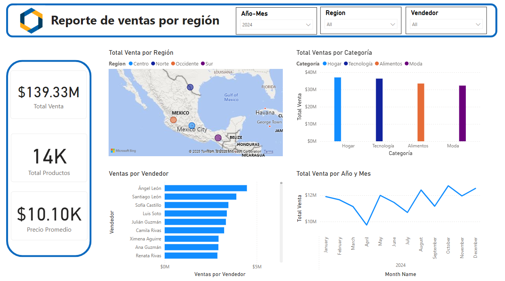
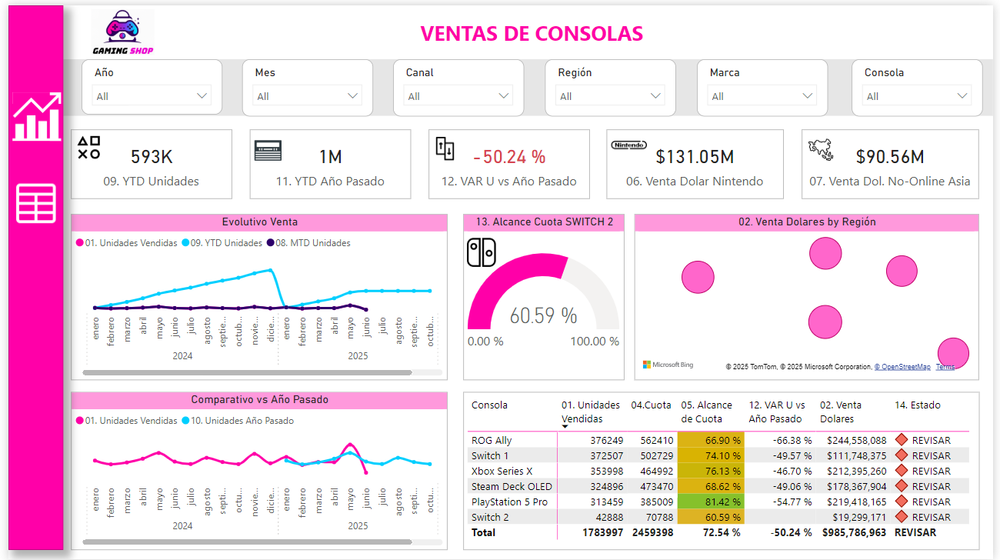

# Visualizaciones con Python y Power BI 

Este repositorio contiene visualizaciones desarrolladas con herramientas como Python (Matplotlib, Seaborn, Plotly) y Power BI. Aquí encontrarás ejemplos de análisis visual, dashboards interactivos y reportes para facilitar la toma de decisiones.

---

## Visualizaciones en Python

> Visualizaciones generadas con bibliotecas como Matplotlib, Seaborn y Plotly.

- Gráficos de barras, líneas y dispersión para análisis exploratorios
- Visualización de tendencias y relaciones entre variables
- Análisis interactivos con Plotly y Dash (en progreso)

Archivos disponibles en la carpeta [`/python`](./python)

---

## Dashboards en Power BI

> Estos dashboards están embebidos y publicados desde Power BI Service a mi sitio web personal.

### 1. Reporte de Ventas Por Región

[Ver dashboard en mi sitio](https://sites.google.com/view/civera-ds/display)  

### 2. Reporte de Ventas de Consolas

 [Ver dashboard en mi sitio](https://sites.google.com/view/civera-ds/display)  
 

---

## Herramientas utilizadas

- **Python:** Pandas, Matplotlib, Seaborn, Plotly
- **Power BI:** Power BI Desktop y Power BI Service
- **Google Sites:** Para mostrar los dashboards embebidos públicamente

---

## Contacto

Email: civera.ds@outlook.com
LinkedIn: https://linkedin.com/in/civera/
GitHub: https://github.com/civera08

---

## Licencia

Este proyecto está licenciado bajo los términos de la [Licencia MIT](./LICENSE).
